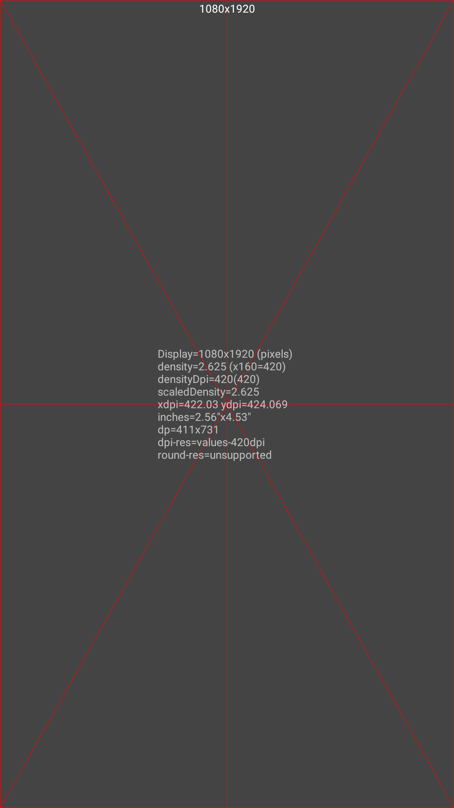
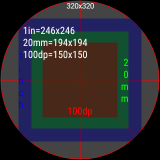
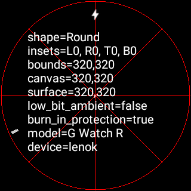

Wear ScreenInfo
===============

This is a utility that shows all kinds of useful information about the
display on your Android and Android Wear devices. When built in release mode
and installed to your phone or tablet, it will also install a wearable APK
to your Android Wear device.

Wear ScreenInfo can be run as a regular application on any device, but is
also available as a watch face on Android Wear. This allows you to get a
complete understanding of every aspect of the display as either an Activity,
or a watch face service.

Some of the information presented includes the display resolution, density,
physical size, resource qualifiers, insets, canvas size, and view size. Extra
information about the hardware is also presented, such as processor, board,
manufacturer, and firmware build id. See the screenshots below for examples
of what the application looks like.

###### Phone-based Activity

###### Wear-based Activity

###### Wear-based WatchFace

Building
--------

This sample uses the Gradle build system. To build this project in release
mode with the embedded wearable APK, you will need to use
"gradlew assembleRelease" or use Android Studio and the "Generate Signed APK"
menu option.

Support
-------

- Google+ Community: https://g.co/androidweardev
- StackOverflow: https://stackoverflow.com/questions/tagged/android-wear

If you've found an error in this sample, please file an issue:
https://github.com/google/wear-screeninfo

Patches are encouraged, and may be submitted by forking this project and
submitting a pull request through GitHub. Please see CONTRIBUTING for more
details.

License
-------

Copyright 2015 Google Inc. All Rights Reserved.

Licensed under the Apache License, Version 2.0 (the "License");
you may not use this file except in compliance with the License.
You may obtain a copy of the License at

http://www.apache.org/licenses/LICENSE-2.0

Unless required by applicable law or agreed to in writing, software
distributed under the License is distributed on an "AS IS" BASIS,
WITHOUT WARRANTIES OR CONDITIONS OF ANY KIND, either express or implied.
See the License for the specific language governing permissions and
limitations under the License.
